.. _sphx_related_work_reference:

Related work
==================

.. _lmr_algorithm:

A Graph Theoretic Additive Approximation of Optimal Transport (LMR algorithm)
--------------------------------------------------------------------------------

Related functions: :func:`cot.transport_lmr`

Abstract
^^^^^^^^^^^^^^^^^^^^^^^^^
Transportation cost is an attractive similarity measure between probability distributions due to its many useful theoretical properties. However, solving optimal transport exactly can be prohibitively expensive. Therefore, there has been significant effort towards the design of scalable approximation algorithms. 
Previous combinatorial results [Sharathkumar, Agarwal STOC ’12, Agarwal, Sharathkumar STOC ’14] have focused primarily on the design of near-linear time multiplicative approximation algorithms. 
There has also been an effort to design approximate solutions with additive errors [Cuturi NIPS ’13, Altschuler et al. NIPS ’17, Dvurechensky et al. ICML ’18, Quanrud, SOSA ’19] within a time bound that is linear in the size of the cost matrix and polynomial in :math:`C/\delta`; here :math:`C` is the largest value in the cost matrix and :math:`\delta` is the additive error. 
We present an adaptation of the classical graph algorithm of Gabow and Tarjan and provide a novel analysis of this algorithm that bounds its execution time by :math:`O(n^2 C/\delta + nC^2/\delta^2)`. 
Our algorithm is extremely simple and executes, for an arbitrarily small constant :math:`\varepsilon`, only :math:`\lfloor 2C/((1−\varepsilon)\delta)\rfloor+1` iterations, where each iteration consists only of a Dijkstra-type search followed by a depth-first search. We also provide empirical results that suggest our algorithm is competitive with respect to a sequential implementation of the Sinkhorn algorithm in execution time. 
Moreover, our algorithm quickly computes a solution for very small values of δ whereas the Sinkhorn algorithm slows down due to numerical instability. `[Full Paper] <https://arxiv.org/pdf/1905.11830>`_

Contributions
^^^^^^^^^^^^^^^^^^^^^^^^^

1. **Novel Algorithm**: The LMR algorithm adapts the classical Gabow-Tarjan cost-scaling approach, providing a new analysis that bounds its execution time by :math:`O(n^2 C/\delta + nC^2/\delta^2)`.

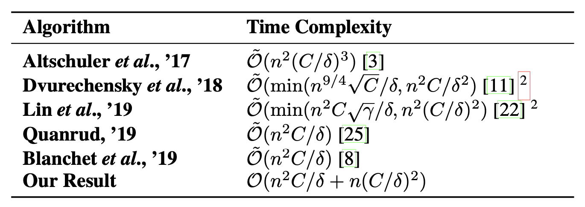
    
    Table of execution time bounds.

2. **Efficiency**: The algorithm executes a limited number of iterations, each involving a Dijkstra-type search followed by a depth-first search. This makes it computationally efficient for very small values of the approximation parameter :math:`\delta`.
3. **Empirical Results**: The paper presents empirical results demonstrating that the proposed algorithm is competitive with the Sinkhorn algorithm, especially for small :math:`\delta` values where the Sinkhorn algorithm suffers from numerical instability.

Experimental Results
^^^^^^^^^^^^^^^^^^^^^^^^^
The experimental results validate the theoretical bounds and show that the proposed algorithm outperforms existing methods in terms of both execution time and "number of iterations". 

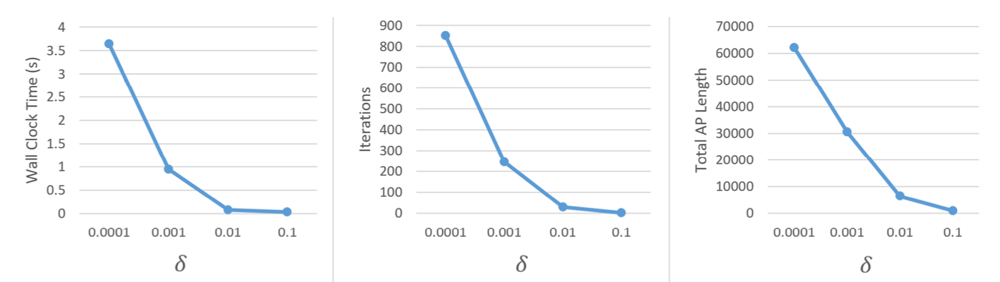

    Efficiency statistics for our algorithm when executed on very small :math:`\delta` values.

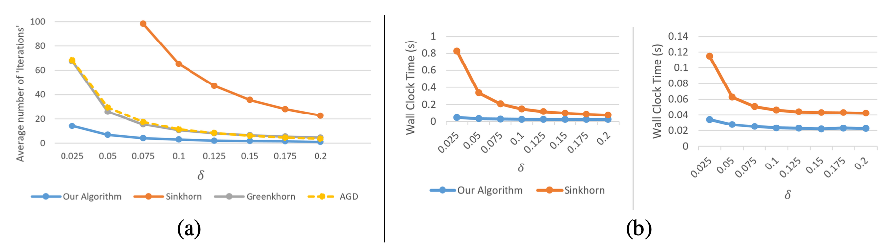

    a: A comparison of the number of iterations executed by various algorithms for moderate values of :math:`\delta`; 
    b: A comparison of our algorithm with the Sinkhorn algorithm using several :math:`\delta` values. We compare running times when both algorithms receive :math:`\delta` as input (left) and compare the running times when Sinkhorn receives :math:`5\delta` and our algorithm receives :math:`\delta` (right).

Citation
^^^^^^^^^^^^^^^^^^^^

.. code-block:: none

   @article{lahn2019graph,
     title={A graph theoretic additive approximation of optimal transport},
     author={Lahn, Nathaniel and Mulchandani, Deepika and Raghvendra, Sharath},
     journal={Advances in Neural Information Processing Systems},
     volume={32},
     year={2019}
   }

.. _push_relable_algorithm:

A Combinatorial Algorithm for Approximating the Optimal Transport in the Parallel and MPC Settings
------------------------------------------------------------------------------------------------------------

Related functions: :func:`cot.transport_torch`, :func:`cot.assignment_torch`, :func:`cot.assignment`

Abstract
^^^^^^^^^^^^^^^^^^^^^^^^^
Optimal Transport is a popular distance metric for measuring similarity between distributions. 
Exact and approximate combinatorial algorithms for computing the optimal transport distance are hard to parallelize. 
This has motivated the development of numerical solvers (e.g. Sinkhorn method) that can exploit GPU parallelism and produce approximate solutions.

We introduce the first parallel combinatorial algorithm to find an additive :math:`\varepsilon`-approximation of the OT distance. 
The parallel complexity of our algorithm is :math:`O(\log(n)/ \varepsilon^2)` where :math:`n` is the total support size for the input distributions. 
In Massive Parallel Computation (MPC) frameworks such as Hadoop and MapReduce, our algorithm computes an :math:`\varepsilon`-approximate transport plan in :math:`O(\log (\log (n/\varepsilon))/\varepsilon^2)` rounds with :math:`O(n/\varepsilon)` space per machine; all prior algorithms in the MPC framework take :math:`\Omega(\log n)` rounds. 
We also provide a GPU-friendly matrix-based interpretation of our algorithm where each step of the algorithm is row or column manipulation of the matrix. Experiments suggest that our combinatorial algorithm is faster than the state-of-the-art approximate solvers in the GPU, especially for higher values of :math:`n`. 
`[Full Paper] <https://proceedings.neurips.cc/paper_files/paper/2023/hash/448444518637da106d978ae7409d9789-Abstract-Conference.html>`_

Contributions
^^^^^^^^^^^^^^^^^^^^^^^^^

1. **Parallel Algorithm**: The proposed algorithm achieves a parallel complexity of :math:`O(log(n)/ε^2)`, where :math:`n` is the total support size for the input distributions.
2. **GPU-Friendly**: The algorithm is also GPU-friendly, leveraging a matrix-based operations where each step involves row or column manipulation.
3. **MPC Framework**: In MPC frameworks such as Hadoop and MapReduce, the algorithm computes an :math:`ε`-approximate transport plan in :math:`O(log(log(n/ε))/ε^2)` rounds with :math:`O(n/ε)` space per machine.

Experimental Results
^^^^^^^^^^^^^^^^^^^^^^^^^
Experimental results demonstrate the algorithm’s superior performance compared to Sinkhorn algorithm, especially for large datasets. 
Tests are conducted on synthetic and real-world data (e.g., MNIST images, word embedings) highlight the algorithm's efficiency in terms of running time and number of iterations.

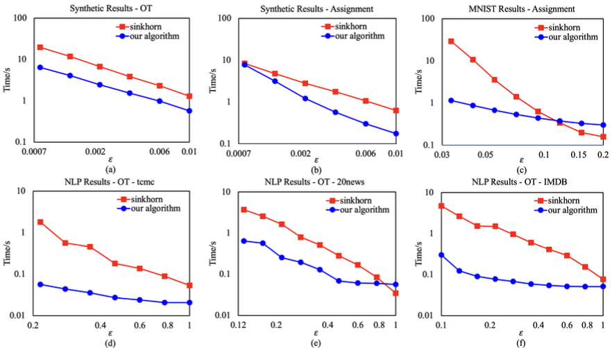

      Plots of running times on GPU for the synthetic inputs (a)(b) and the real data inputs (c)(d)(e)(f).

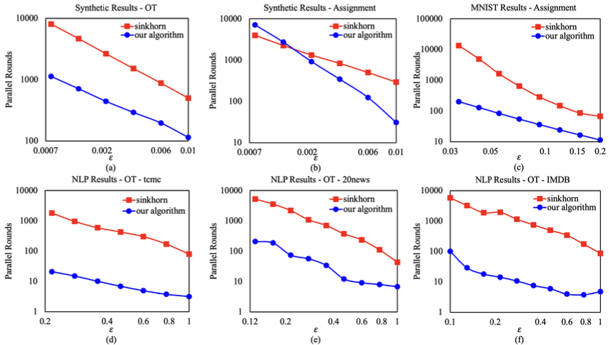
  
      Plots of parallel rounds on GPU for the synthetic inputs (a)(b) and the real data inputs (c)(d)(e)(f).

Citation:
^^^^^^^^^^^^^^^^^^^^^^^^^

.. code-block:: none

   @article{lahn2023combinatorial,
     title={A combinatorial algorithm for approximating the optimal transport in the parallel and mpc settings},
     author={Lahn, Nathaniel and Raghvendra, Sharath and Zhang, Kaiyi},
     journal={Advances in Neural Information Processing Systems},
     volume={36},
     pages={21675--21686},
     year={2023}
   }

.. _otp:

Computing All Optimal Partial Transport
-------------------------------------------

Related functions: :func:`cot.ot-profile`

Abstract
^^^^^^^^^^^^^^^^^^^^^^^^^

We consider the classical version of the optimal partial transport problem. 
Let :math:`\mu` (with a mass of :math:`U`) and :math:`\nu` (with a mass of :math:`S`) be two discrete mass distributions with :math:`S \le U` and let :math:`n` be the total number of points in the supports of :math:`\mu` and :math:`\nu`. 
For a parameter :math:`\alpha \in [0,S]`, consider the minimum-cost transport plan :math:`\sigma_\alpha` that transports a mass of :math:`\alpha` from :math:`\nu` to :math:`\mu`. 
An *OT-profile* captures the behavior of the cost of :math:`\sigma_\alpha` as :math:`\alpha` varies from 0 to :math:`S`. There is only limited work on OT-profile and its mathematical properties (see Figalli (2010)). 
In this paper, we present a novel framework to analyze the properties of the OT-profile and also present an algorithm to compute it. 
When :math:`\mu` and :math:`\nu` are discrete mass distributions, we show that the OT-profile is a piecewise-linear non-decreasing convex function. 
Let :math:`K` be the combinatorial complexity of this function, i.e., the number of line segments required to represent the OT-profile. 
Our exact algorithm computes the OT-profile in :math:`\tilde{O}(n^2K)` time. Given :math:`\delta > 0`, we also show that the algorithm by Lahn et al. (2019) can be used to :math:`\delta`-approximate the OT-profile in :math:`O(n^2/\delta + n/\delta^2)` time. 
This approximation is a piecewise-linear function of a combinatorial complexity of :math:`O(1/\delta)`.

An OT-profile is arguably more valuable than the OT-cost itself and can be used within applications. Under a reasonable assumption of outliers, we also show that the first derivative of the OT-profile sees a noticeable rise before any of the mass from outliers is transported. 
By using this property, we get an improved prediction accuracy for an outlier detection experiment. We also use this property to predict labels and estimate the class priors within PU-Learning experiments. Both these experiments are conducted on real datasets.
`[Full Paper] <https://openreview.net/pdf?id=gwcQajoXNF>`_

Contributions:
^^^^^^^^^^^^^^^^

1. **Novel Framework**: This work presents a framework to analyze the relationship between the cost of partial optimal transport and the transrpot mass, showing that it is a piecewise-linear, convex function, which is called OT-profile in this work.
2. **Exact Algorithm**: This work proposes a primal-dual based combinatorial algorithm to compute the exact OT profile in :math:`O(n^2 K)` time, where :math:`K` is the profile's combinatorial complexity.
3. **Approximation Algorithm**: The paper presents an approximation algorithm that computes a :math:`δ`-approximate OT profile in :math:`O(n^2/δ + n/δ^2)` time.
4. **Applications**: The OT-profile is used to improve outlier detection and Positive Unlabelled (PU) learning, demonstrating its practical value.

Experimental Results:
^^^^^^^^^^^^^^^^^^^^^^^^^
Experiments validate the theoretical claims and showcase the algorithm's performance on real-world datasets in missions of outlier detection and PU-Learning. 
The OT profile significantly improves outlier detection and PU learning accuracy witout the knowledge of the class priors.

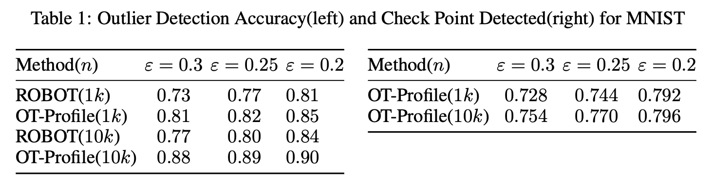

      Outlier detection accuracy comparison between OT-profile and existing methods.

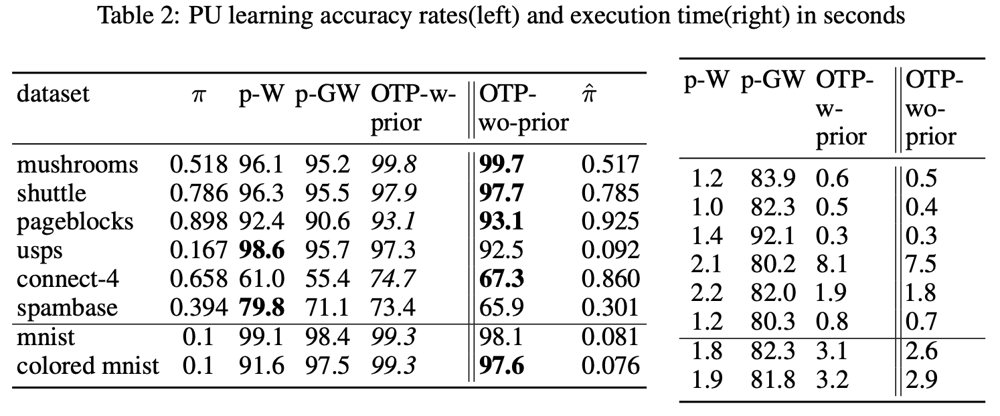
  
      PU-learning accuracy rates for various datasets between OT-profile and existing methods.

Citation:
^^^^^^^^^^^^^^^^

.. code-block:: none

   @inproceedings{phatak2023computing,
     title={Computing all optimal partial transports},
     author={Phatak, Abhijeet and Raghvendra, Sharath and Tripathy, Chittaranjan and Zhang, Kaiyi},
     booktitle={International Conference on Learning Representations},
     year={2023}
   }

.. _rpw:

A New Robust Partial p-Wasserstein-Based Metric for Comparing Distributions
--------------------------------------------------------------------------------

Related functions: :func:`cot.rpw_distance`

Abstract
^^^^^^^^^^^^^^^^^^^^^^^^^
The :math:`2`-Wasserstein distance is sensitive to minor geometric differences between distributions, making it a very powerful dissimilarity metric. 
However, due to this sensitivity, a small outlier mass can also cause a significant increase in the :math:`2`-Wasserstein distance between two similar distributions. 
Similarly, sampling discrepancy can cause the empirical :math:`2`-Wasserstein distance on :math:`n` samples in :math:`\mathbb{R}^2` to converge to the true distance at a rate of :math:`n^{-1/4}`, which is significantly slower than the rate of :math:`n^{-1/2}` for :math:`1`-Wasserstein distance.

We introduce a new family of distances parameterized by :math:`k \ge 0`, called :math:`k`-RPW, that is based on computing the partial :math:`2`-Wasserstein distance. 
We show that (1) :math:`k`-RPW satisfies the metric properties, (2) :math:`k`-RPW is robust to small outlier mass while retaining the sensitivity of :math:`2`-Wasserstein distance to minor geometric differences, and (3) when :math:`k` is a constant, :math:`k`-RPW distance between empirical distributions on :math:`n` samples in :math:`\mathbb{R}^2` converges to the true distance at a rate of :math:`n^{-1/3}`, which is faster than the convergence rate of :math:`n^{-1/4}` for the :math:`2`-Wasserstein distance.

Using the partial :math:`p`-Wasserstein distance, we extend our distance to any :math:`p \in [1,\infty]`. 
By setting parameters :math:`k` or :math:`p` appropriately, we can reduce our distance to the total variation, :math:`p`-Wasserstein, and the Lévy-Prokhorov distances. 
Experiments show that our distance function achieves higher accuracy in comparison to the :math:`1`-Wasserstein, :math:`2`-Wasserstein, and TV distances for image retrieval tasks on noisy real-world datasets.
`[Full Paper] <https://icml.cc/virtual/2024/poster/33067>`_

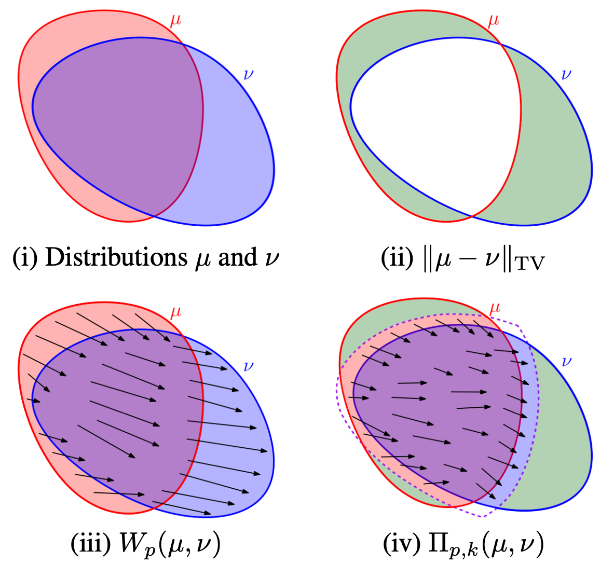

    Interpretations of different distance functions.

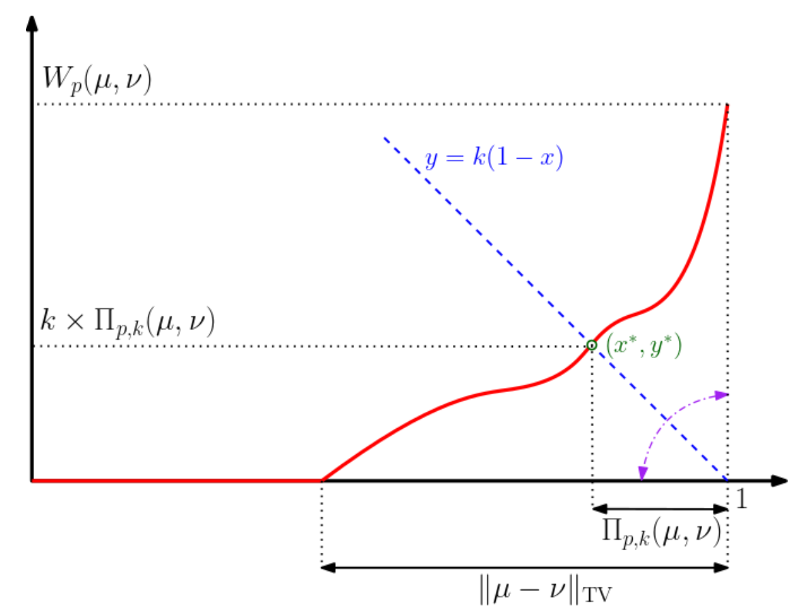

    Interpretation of distances based on the OT-profile.

Contributions:
^^^^^^^^^^^^^^^^

1. **Metric Properties**: The :math:`k`-RPW distance satisfies the properties of a metric, including the triangle inequality.

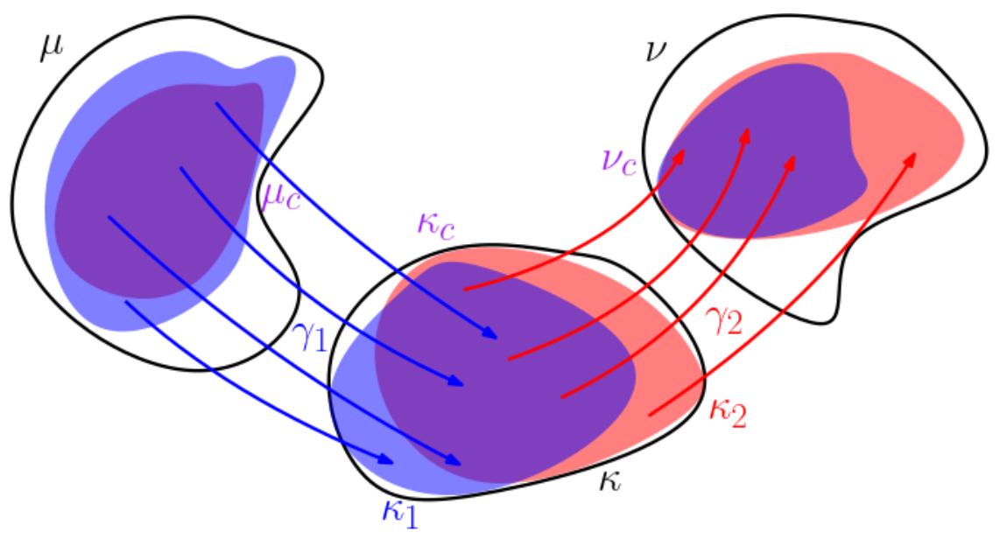

    The triangle inequality of the RPW distance function.

2. **Robustness**: The :math:`k`-RPW distance is robust to small outlier masses and sampling discrepancies, ensuring that minor noise does not disproportionately affect the distance.

3. **Faster Convergence**: The :math:`k`-RPW distance between empirical distributions converges to the true distance at a faster rate compared to the :math:`2`-Wasserstein distance.

4. **Generalization**: The partial :math:`p`-Wasserstein distance is extended to any :math:`p \in [1, \infty]` and :math:`k \in [0, \infty]`, allowing the metric to interpolate between total variation, :math:`p`-Wasserstein, and Lévy-Prokhorov distances.

Experimental Results:
^^^^^^^^^^^^^^^^^^^^^^^^^
The experimental results demonstrate the effectiveness of the :math:`k`-RPW distance in image retrieval task. The :math:`k`-RPW distance outperforms the distances including :math:`1`-Wasserstein, :math:`2`-Wasserstein, and total variation (TV) distances in terms of accuracy in present of different types of perturbations.
Additionaly, this work showcased the convergence rate of the :math:`(2,k)`-RPW distance is faster than the :math:`2`-Wasserstein distance for empirical distributions.

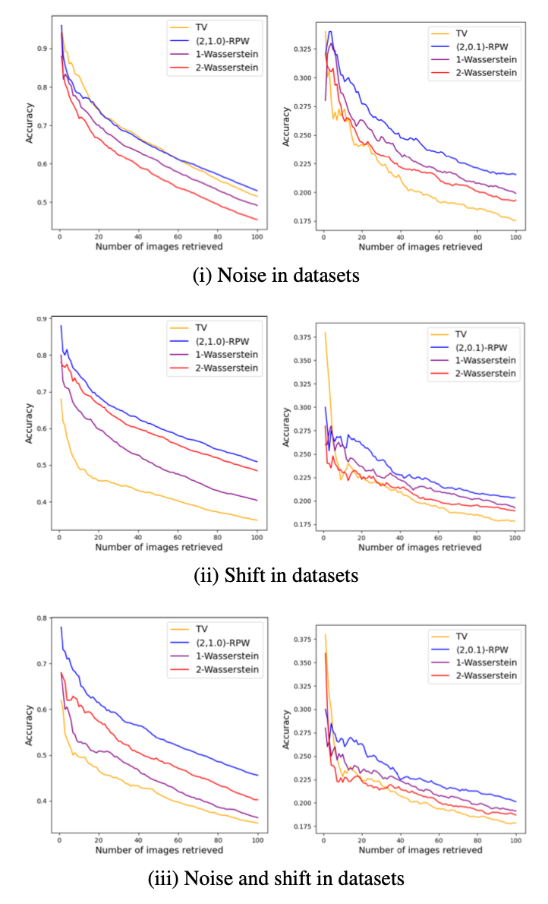

    The results of experiments on image retrieval on (left column) MNIST dataset and (right column) CIFAR-10 dataset.

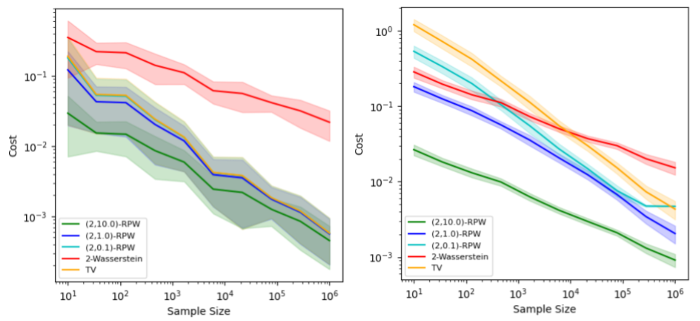

    The convergence rate of different metrics on (left) 2-point distribution and (right) grid distribution.

Citation:
^^^^^^^^^^^^^^^^

.. code-block:: none

   @inproceedings{raghvendranew,
     title={A New Robust Partial p-Wasserstein-Based Metric for Comparing Distributions},
     author={Raghvendra, Sharath and Shirzadian, Pouyan and Zhang, Kaiyi},
     booktitle={Forty-first International Conference on Machine Learning}
   }

